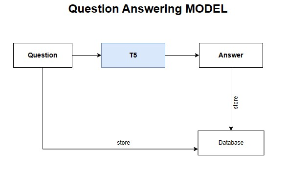

# Question Answering 
 - T5, or Text-to-Text Transfer Transformer, is a Transformer based architecture that uses a 
   text-to-text approach. Every task – including translation, question answering, and classification – is cast as feeding the model text as input and training it to generate some target text. This allows for the use of the same model, loss function, hyperparameters, etc. across our diverse set of tasks.

### AI Models

- Text-to-Text Transfer Transformer (T5)

## Technologies
- FASTAPI
- sqlite database
- Natural Language processing
- Large Language Model
- text Processing

## Framework 
- FASTAPI

## Usage
  git clone https://github.com/Shymaa2611/QA_API.git
   
  cd QA_API
   
  pip install -r requirements.txt
   
  uvicorn main:app --reload

### Running
 
  - http://127.0.0.1:8000/docs

### Deploy

  

